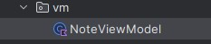
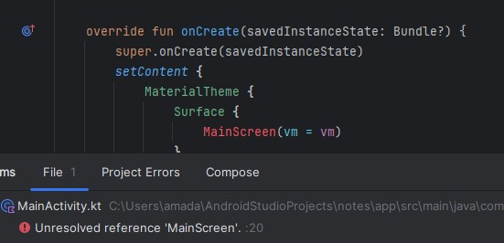

## Notes App 
Amada Noemi Cárcamo Renderos 
### MVVM
- **Modelo (Note.kt):** define la entidad Nota.
- **ViewModel (NoteViewModel):** mantiene el estado y la lógica.
- **Vista (MainScreen, MainActivity):** muestra datos y envía eventos al ViewModel.
  
### Capturas
Paso 1: Configuramos el build.gradle

Paso 2: Crear carpeta del model y crear la clase Note 

Paso 3: Crear el paquete vm

•Agregamos NoteViewModel.kt con todas sus funcionalidades 

Paso 4: Modificamos el Main Activity.kt

Paso 5: Creamos el MainSreen.kt 

Paso 6: Aplicacion ejecutandose 

•	Presiona Agregar → debe aparecer en la lista

•	Notas agregadas 

•	Presiona Eliminar → debe desaparecer.

•	Pruebas al rotar la pantalla 

### Errores
Error 1: Error generado por utilizar llaves 

Solucion: Colocar parentesis en lugar de las llaves 

Error 2: Unresolved reference: 'MainScreen'-significa que todavía no existe ninguna funcion con el nombre MainSreen 

Solucion: Crear el MainScreen

